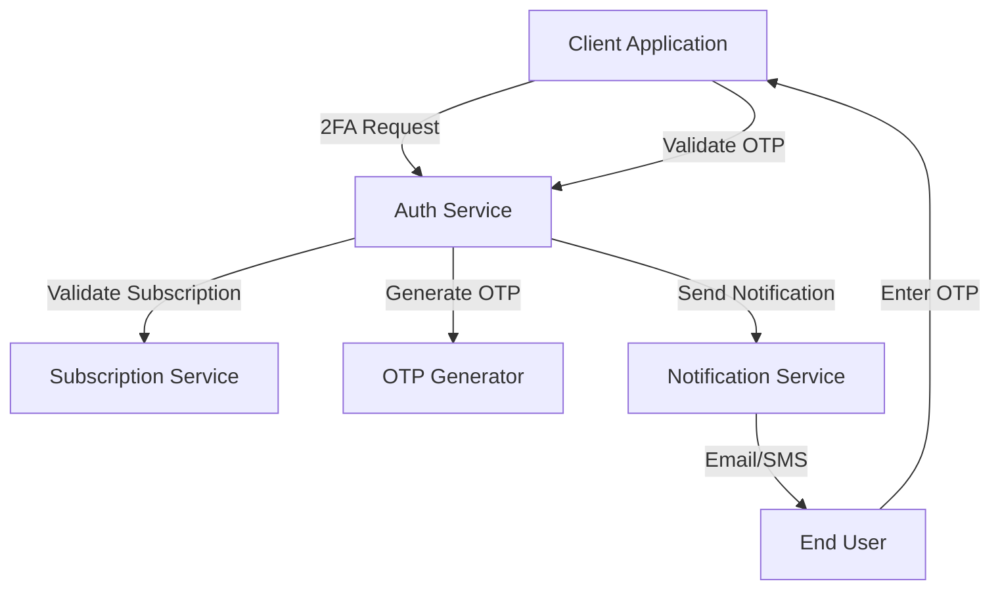

# Two-Factor Authentication - Technical Implementation Guide

A comprehensive guide covering the technical implementation of Two-Factor Authentication (2FA) integration with a notification service. This system generates OTPs, validates quotas, and sends templated notification requests while the notification service handles content formatting, localization, and delivery.

## Table of Contents

- [Overview](#overview)
- [System Architecture](#system-architecture)
- [API Implementation](#api-implementation)
- [Notification Service Integration](#notification-service-integration)
- [OTP Generation and Management](#otp-generation-and-management)
- [Client Implementation Examples](#client-implementation-examples)
- [Error Handling Strategies](#error-handling-strategies)
- [Testing Strategies](#testing-strategies)
- [Related Documentation](#related-documentation)

## Overview

The Two-Factor Authentication system provides an additional layer of security by requiring users to verify their identity through a second factor - typically a code sent via email or SMS. Our implementation is designed to be flexible, secure, and easy to integrate with existing applications.

The auth service handles OTP generation and validation, while delegating the actual message delivery to a specialized notification service. This separation of concerns ensures better maintainability and allows for easy scaling of notification capabilities.

## System Architecture



## API Implementation

### 1. Trigger 2FA Endpoint

**Endpoint:** `POST /internal/2fa/send`

This endpoint initiates the 2FA process by generating an OTP and sending it through the notification service.

**Implementation Logic:**
```go
func (h *TwoFactorHandler) SendOTP(c *gin.Context) {
    var req SendOTPRequest
    if err := c.ShouldBindJSON(&req); err != nil {
        c.JSON(http.StatusBadRequest, gin.H{
            "success": false,
            "error":   "INVALID_REQUEST",
            "message": "Invalid request format",
        })
        return
    }

    // Validate subscription and quotas
    if err := h.subscriptionService.ValidateFeature(req.ClientID, req.Channel); err != nil {
        c.JSON(http.StatusPaymentRequired, gin.H{
            "success": false,
            "error":   "INVALID_SUBSCRIPTION",
            "message": err.Error(),
        })
        return
    }

    // Generate OTP
    otp, err := h.otpService.GenerateOTP(req.ClientID, req.UserID, req.Channel)
    if err != nil {
        c.JSON(http.StatusInternalServerError, gin.H{
            "success": false,
            "error":   "OTP_GENERATION_FAILED",
            "message": err.Error(),
        })
        return
    }

    // Send notification
    messageID, err := h.notificationService.SendOTP(NotificationRequest{
        ClientID:   req.ClientID,
        Channel:    req.Channel,
        Recipient:  req.Recipient,
        Variables: map[string]interface{}{
            "otp":          otp.Code,
            "user_name":    req.UserName,
            "expiry_value": otp.ExpiryMinutes,
            "expiry_unit":  "MINUTES",
            "client_name":  "Your Application",
        },
    })

    if err != nil {
        c.JSON(http.StatusServiceUnavailable, gin.H{
            "success": false,
            "error":   "NOTIFICATION_FAILED",
            "message": err.Error(),
        })
        return
    }

    c.JSON(http.StatusOK, gin.H{
        "success":          true,
        "message":          fmt.Sprintf("2FA code sent via %s", req.Channel),
        "otp_digit_length": otp.DigitLength,
        "expires_in":       otp.ExpiryMinutes * 60,
        "message_id":       messageID,
    })
}
```

**Request Structure:**
```json
{
  "user_id": "user-456",
  "client_id": "client-123",
  "channel": "EMAIL",
  "recipient": "user@example.com",
  "user_name": "John Doe"
}
```

**Success Response (200):**
```json
{
  "success": true,
  "message": "2FA code sent via EMAIL",
  "otp_digit_length": 6,
  "expires_in": 300,
  "message_id": "msg-12345"
}
```

**Error Responses:**
```json
// 429 - Quota Exceeded
{
  "success": false,
  "error": "2FA_QUOTA_EXCEEDED",
  "message": "The client's EMAIL 2FA quota has been exceeded"
}

// 403 - Feature Disabled
{
  "success": false,
  "error": "FEATURE_DISABLED",
  "message": "2FA EMAIL feature is not enabled for this client"
}

// 402 - Invalid Subscription
{
  "success": false,
  "error": "INVALID_SUBSCRIPTION",
  "message": "Client subscription is invalid"
}
```

### 2. Validate 2FA Endpoint

**Endpoint:** `POST /internal/2fa/validate`

This endpoint validates the OTP code entered by the user.

**Implementation:**
```go
func (h *TwoFactorHandler) ValidateOTP(c *gin.Context) {
    var req ValidateOTPRequest
    if err := c.ShouldBindJSON(&req); err != nil {
        c.JSON(http.StatusBadRequest, gin.H{
            "success": false,
            "error":   "INVALID_REQUEST",
            "message": "Invalid request format",
        })
        return
    }

    // Validate OTP
    valid, err := h.otpService.ValidateOTP(req.TenantID, req.Email, req.Code)
    if err != nil {
        if errors.Is(err, ErrOTPExpired) || errors.Is(err, ErrOTPInvalid) {
            c.JSON(http.StatusUnauthorized, gin.H{
                "success": false,
                "error":   "INVALID_OTP",
                "message": "Invalid or expired OTP",
            })
            return
        }

        c.JSON(http.StatusInternalServerError, gin.H{
            "success": false,
            "error":   "VALIDATION_FAILED",
            "message": err.Error(),
        })
        return
    }

    if !valid {
        c.JSON(http.StatusUnauthorized, gin.H{
            "success": false,
            "error":   "INVALID_OTP",
            "message": "Invalid or expired OTP",
        })
        return
    }

    c.JSON(http.StatusOK, gin.H{
        "success": true,
        "message": "2FA validation successful",
    })
}
```

### 3. Get 2FA Status Endpoint

**Endpoint:** `GET /internal/2fa/status/:client_id`

This endpoint retrieves the current 2FA configuration and usage statistics.

**Response Structure:**
```json
{
  "client_id": "client-123",
  "email_enabled": true,
  "sms_enabled": true,
  "otp_digit_length": 6,
  "expiration_minutes": 5,
  "max_attempts": 3,
  "rate_limit_per_hour": 5,
  "usage_stats": {
    "monthly_limit": 1000,
    "current_usage": 150,
    "remaining": 850,
    "usage_percentage": 15.0,
    "billing_cycle_end": "2025-07-01T00:00:00Z"
  }
}
```

## Notification Service Integration

### Payload Structure

The notification service receives structured requests with template variables:

```go
type NotificationRequest struct {
    ClientID   string                 `json:"client_id"`
    Channel    string                 `json:"channel"`
    TemplateID string                 `json:"template_id"`
    Recipient  string                 `json:"recipient"`
    Variables  map[string]interface{} `json:"variables"`
}
```

**Example Payload:**
```json
{
  "client_id": "client-123",
  "channel": "SMS",
  "template_id": "2FA_CODE",
  "recipient": "user@example.com",
  "variables": {
    "otp": "928371",
    "user_name": "John",
    "expiry_value": 5,
    "expiry_unit": "MINUTES",
    "client_name": "Your Application"
  }
}
```

### Circuit Breaker Implementation

To ensure system resilience, we implement circuit breaker patterns for external service calls:

```go
type NotificationClient struct {
    httpClient *http.Client
    breaker    *gobreaker.CircuitBreaker
    baseURL    string
}

func (c *NotificationClient) SendNotification(req NotificationRequest) (string, error) {
    result, err := c.breaker.Execute(func() (interface{}, error) {
        resp, err := c.sendHTTPRequest(req)
        if err != nil {
            return nil, err
        }
        return resp.MessageID, nil
    })

    if err != nil {
        return "", fmt.Errorf("notification service unavailable: %w", err)
    }

    return result.(string), nil
}

func (c *NotificationClient) sendHTTPRequest(req NotificationRequest) (*NotificationResponse, error) {
    jsonData, err := json.Marshal(req)
    if err != nil {
        return nil, err
    }

    httpReq, err := http.NewRequest("POST", c.baseURL+"/notifications/send", bytes.NewBuffer(jsonData))
    if err != nil {
        return nil, err
    }

    httpReq.Header.Set("Content-Type", "application/json")
    
    resp, err := c.httpClient.Do(httpReq)
    if err != nil {
        return nil, err
    }
    defer resp.Body.Close()

    if resp.StatusCode != http.StatusOK {
        return nil, fmt.Errorf("notification failed with status: %d", resp.StatusCode)
    }

    var notificationResp NotificationResponse
    if err := json.NewDecoder(resp.Body).Decode(&notificationResp); err != nil {
        return nil, err
    }

    return &notificationResp, nil
}
```

## OTP Generation and Management

### OTP Service Implementation

The OTP service handles secure generation and validation of one-time passwords:

```go
type OTPService struct {
    storage    OTPStorage
    config     OTPConfig
    generator  *crypto/rand.Rand
}

func (s *OTPService) GenerateOTP(clientID, userID, channel string) (*OTP, error) {
    // Get client-specific configuration
    config, err := s.getClientConfig(clientID)
    if err != nil {
        return nil, err
    }

    // Generate cryptographically secure OTP
    code, err := s.generateSecureCode(config.DigitLength)
    if err != nil {
        return nil, err
    }

    otp := &OTP{
        Code:          code,
        UserID:        userID,
        ClientID:      clientID,
        Channel:       channel,
        DigitLength:   config.DigitLength,
        ExpiryMinutes: config.ExpiryMinutes,
        CreatedAt:     time.Now(),
        ExpiresAt:     time.Now().Add(time.Duration(config.ExpiryMinutes) * time.Minute),
        Attempts:      0,
        MaxAttempts:   config.MaxAttempts,
    }

    // Store OTP
    if err := s.storage.Store(otp); err != nil {
        return nil, err
    }

    return otp, nil
}

func (s *OTPService) generateSecureCode(digitLength int) (string, error) {
    if digitLength <= 0 {
        return "", fmt.Errorf("digit length must be positive, got %d", digitLength)
    }

    max := int64(math.Pow(10, float64(digitLength)))
    n, err := rand.Int(rand.Reader, big.NewInt(max))
    if err != nil {
        return "", err
    }

    return fmt.Sprintf("%0*d", digitLength, n.Int64()), nil
}
```

### Validation Logic

The validation process includes several security checks:

```go
func (s *OTPService) ValidateOTP(clientID, identifier, code string) (bool, error) {
    otp, err := s.storage.GetByIdentifier(clientID, identifier)
    if err != nil {
        if errors.Is(err, ErrOTPNotFound) {
            return false, ErrOTPInvalid
        }
        return false, err
    }

    // Check expiration
    if time.Now().After(otp.ExpiresAt) {
        s.storage.Delete(otp.ID)
        return false, ErrOTPExpired
    }

    // Check attempts
    if otp.Attempts >= otp.MaxAttempts {
        s.storage.Delete(otp.ID)
        return false, ErrOTPMaxAttemptsExceeded
    }

    // Increment attempts
    otp.Attempts++
    s.storage.Update(otp)

    // Validate code
    if otp.Code != code {
        return false, ErrOTPInvalid
    }

    // Mark as used
    s.storage.Delete(otp.ID)
    return true, nil
}
```

## Client Implementation Examples

### JavaScript and Node.js Client

Here's a complete client implementation for web applications:

```javascript
class TwoFactorClient {
  constructor(baseURL, tenantToken) {
    this.baseURL = baseURL;
    this.tenantToken = tenantToken;
  }

  async trigger2FA(userId, clientId, channel, recipient, userName) {
    const response = await fetch(`${this.baseURL}/internal/2fa/send`, {
      method: 'POST',
      headers: {
        'Content-Type': 'application/json',
        'X-Tenant-Token': this.tenantToken
      },
      body: JSON.stringify({
        user_id: userId,
        client_id: clientId,
        channel: channel,
        recipient: recipient,
        user_name: userName
      })
    });

    const result = await response.json();
    
    if (!response.ok) {
      throw new Error(`2FA Trigger Failed: ${result.error} - ${result.message}`);
    }

    return {
      messageId: result.message_id,
      digitLength: result.otp_digit_length,
      expiresIn: result.expires_in
    };
  }

  async validate2FA(tenantId, identifier, code) {
    const response = await fetch(`${this.baseURL}/internal/2fa/validate`, {
      method: 'POST',
      headers: {
        'Content-Type': 'application/json',
        'X-Tenant-Token': this.tenantToken
      },
      body: JSON.stringify({
        tenant_id: tenantId,
        email: identifier,
        code: code
      })
    });

    const result = await response.json();
    
    if (!response.ok) {
      throw new Error(`2FA Validation Failed: ${result.error} - ${result.message}`);
    }

    return result.success;
  }

  async get2FAStatus(clientId) {
    const response = await fetch(`${this.baseURL}/internal/2fa/status/${clientId}`, {
      headers: {
        'X-Tenant-Token': this.tenantToken
      }
    });

    if (!response.ok) {
      throw new Error(`Failed to get 2FA status: ${response.status}`);
    }

    return await response.json();
  }
}

// Usage example
const twoFactorClient = new TwoFactorClient('http://localhost:8080', 'your-tenant-token');

try {
  // Trigger 2FA
  const triggerResult = await twoFactorClient.trigger2FA(
    'user-123', 'client-456', 'EMAIL', 'user@example.com', 'John Doe'
  );
  
  console.log(`2FA sent! Message ID: ${triggerResult.messageId}`);
  console.log(`${triggerResult.digitLength}-digit code expires in ${triggerResult.expiresIn} seconds`);
  
  // User enters OTP
  const userCode = '123456'; // From user input
  
  // Validate 2FA
  const isValid = await twoFactorClient.validate2FA('client-456', 'user@example.com', userCode);
  console.log('2FA validation result:', isValid);
  
} catch (error) {
  console.error('2FA error:', error.message);
}
```

### Go Client Implementation

For backend services, here's a Go client implementation:

```go
type TwoFactorClient struct {
    baseURL     string
    tenantToken string
    httpClient  *http.Client
}

func (c *TwoFactorClient) Trigger2FA(ctx context.Context, req Trigger2FARequest) (*Trigger2FAResponse, error) {
    jsonData, err := json.Marshal(req)
    if err != nil {
        return nil, err
    }

    httpReq, err := http.NewRequestWithContext(ctx, "POST", c.baseURL+"/internal/2fa/send", bytes.NewBuffer(jsonData))
    if err != nil {
        return nil, err
    }

    httpReq.Header.Set("Content-Type", "application/json")
    httpReq.Header.Set("X-Tenant-Token", c.tenantToken)

    resp, err := c.httpClient.Do(httpReq)
    if err != nil {
        return nil, err
    }
    defer resp.Body.Close()

    var result Trigger2FAResponse
    if err := json.NewDecoder(resp.Body).Decode(&result); err != nil {
        return nil, err
    }

    if !result.Success {
        return nil, fmt.Errorf("2FA trigger failed: %s - %s", result.Error, result.Message)
    }

    return &result, nil
}

func (c *TwoFactorClient) Validate2FA(ctx context.Context, req Validate2FARequest) (bool, error) {
    jsonData, err := json.Marshal(req)
    if err != nil {
        return false, err
    }

    httpReq, err := http.NewRequestWithContext(ctx, "POST", c.baseURL+"/internal/2fa/validate", bytes.NewBuffer(jsonData))
    if err != nil {
        return false, err
    }

    httpReq.Header.Set("Content-Type", "application/json")
    httpReq.Header.Set("X-Tenant-Token", c.tenantToken)

    resp, err := c.httpClient.Do(httpReq)
    if err != nil {
        return false, err
    }
    defer resp.Body.Close()

    var result Validate2FAResponse
    if err := json.NewDecoder(resp.Body).Decode(&result); err != nil {
        return false, err
    }

    if !result.Success {
        return false, fmt.Errorf("2FA validation failed: %s - %s", result.Error, result.Message)
    }

    return result.Success, nil
}
```

## Error Handling Strategies

### Retry Logic with Exponential Backoff

For resilient communication with external services:

```go
func (c *NotificationClient) SendWithRetry(req NotificationRequest) (string, error) {
    const maxRetries = 3
    baseDelay := time.Second

    for attempt := 0; attempt < maxRetries; attempt++ {
        messageID, err := c.SendNotification(req)
        if err == nil {
            return messageID, nil
        }

        if attempt < maxRetries-1 {
            delay := baseDelay * time.Duration(math.Pow(2, float64(attempt)))
            time.Sleep(delay)
        }
    }

    return "", fmt.Errorf("notification failed after %d attempts", maxRetries)
}
```

### Subscription Service Fallback

Handle subscription service outages gracefully:

```go
func (s *SubscriptionService) ValidateFeatureWithFallback(clientID, feature string) error {
    // Try with circuit breaker
    result, err := s.breaker.Execute(func() (interface{}, error) {
        return s.validateFeatureHTTP(clientID, feature)
    })

    if err != nil {
        // Fallback to cached data
        if cached, found := s.cache.Get(clientID); found {
            if subscription := cached.(*Subscription); subscription.HasFeature(feature) {
                return nil
            }
        }
        
        // Default to deny if no cache
        return fmt.Errorf("subscription validation failed: %w", err)
    }

    return result.(error)
}
```

## Testing Strategies

### Unit Tests

Comprehensive unit testing ensures reliability:

```go
func TestOTPService_GenerateOTP(t *testing.T) {
    tests := []struct {
        name         string
        digitLength  int
        expectError  bool
    }{
        {"4 digit OTP", 4, false},
        {"6 digit OTP", 6, false},
        {"8 digit OTP", 8, false},
        {"Invalid 0 digits", 0, true},
        {"Invalid negative digits", -1, true},
    }

    for _, tt := range tests {
        t.Run(tt.name, func(t *testing.T) {
            service := NewOTPService(mockStorage, OTPConfig{DigitLength: tt.digitLength})
            
            otp, err := service.GenerateOTP("client-123", "user-456", "EMAIL")
            
            if tt.expectError {
                assert.Error(t, err)
                assert.Nil(t, otp)
            } else {
                assert.NoError(t, err)
                assert.NotNil(t, otp)
                assert.Len(t, otp.Code, tt.digitLength)
                assert.Regexp(t, "^[0-9]+$", otp.Code)
            }
        })
    }
}
```

### Integration Tests

End-to-end testing validates the complete flow:

```go
func TestTwoFactorFlow_Integration(t *testing.T) {
    // Setup test environment
    client := setupTestClient(t)
    
    // Trigger 2FA
    result, err := client.Trigger2FA(context.Background(), Trigger2FARequest{
        UserID:    "test-user",
        ClientID:  "test-client",
        Channel:   "EMAIL",
        Recipient: "test@example.com",
        UserName:  "Test User",
    })
    
    require.NoError(t, err)
    assert.NotEmpty(t, result.MessageID)
    assert.Equal(t, 6, result.OTPDigitLength)
    
    // Get OTP from test database
    otp := getOTPFromDatabase(t, "test-client", "test@example.com")
    
    // Validate 2FA
    valid, err := client.Validate2FA(context.Background(), Validate2FARequest{
        TenantID: "test-client",
        Email:    "test@example.com",
        Code:     otp.Code,
    })
    
    require.NoError(t, err)
    assert.True(t, valid)
}
```

## Related Documentation

- [Multi-Tenant Auth Service Integration Guide](SAAS_CLIENT_GUIDE.md) - Main integration guide
- [Tenant Authentication Implementation Guide](TENANT_AUTHENTICATION_GUIDE.md) - Tenant authentication details
- [Tenant Authentication Examples](TENANT_AUTHENTICATION_EXAMPLES.md) - Complete flow examples
- [Circuit Breaker Design Guide](CIRCUIT_BREAKER_DESIGN_GUIDE.md) - Fault tolerance patterns
- [Testing Documentation](TESTING.md) - Testing strategies and examples
- [Actuator Documentation](ACTUATOR.md) - Monitoring and health checks

This technical implementation guide provides comprehensive coverage of 2FA system architecture, API design, error handling, and testing strategies for production deployment. The patterns and examples shown here will help you build a secure and reliable two-factor authentication system. 